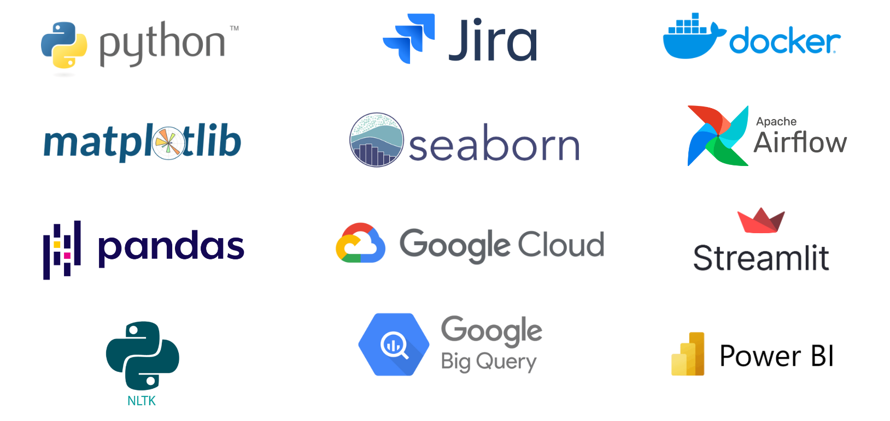
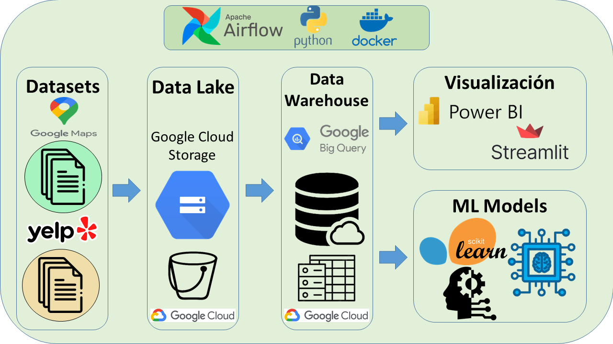
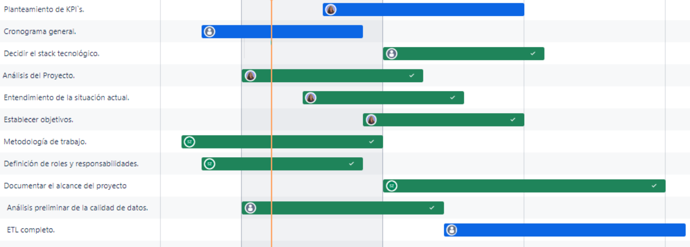

# YELP & GOOGLE MAPS - REVIEWS AND RECOMMENDATIONS

<strong>Índice</strong>

- [Acerca del Proyecto](#acerca-del-proyecto)
- [Alcance](#alcance)
- [Objetivos Generales](#objetivo-general)
  - [Objetivos Específicos](#objetivos-específicos)
- [KPIs (Indicadores Clave de Rendimiento)](#kpis-indicadores-clave-de-rendimiento)
- [Stack Tecnológico](#stack-tecnológico)
- [Pipeline](#pipeline)
- [Diagrama de Gantt](#diagrama-de-gantt)
- [Dashboard](#dashboard)
- [Sistema de Recomendación](#sistema-de-recomendación)
- [Integrantes](#integrantes)

## Acerca del Proyecto

Como consultora de datos, hemos sido seleccionados para realizar un análisis exhaustivo del mercado estadounidense para un cliente dentro del sector de restaurantes y afines. Nuestro enfoque principal ha sido desarrollar un sistema de recomendación de restaurantes, utilizando datos de plataformas como Google Maps y Yelp. Este sistema proporciona información valiosa para los inversores, ayudándoles en la toma de decisiones estratégicas.

## Alcance

- **Categorías Gastronómicas:** El análisis se centrará exclusivamente en el rubro gastronómico, en específico restaurantes. Otras categorías fuera de este ámbito no serán consideradas en el alcance del proyecto.

- **Área Geográfica:** El análisis se limitará a cinco estados de los Estados Unidos: California, Florida, Nevada, Hawái y Nueva York.

- **Fuentes de Datos:** Utilizaremos principalmente los datos proporcionados por la compañía, obtenidos de fuentes como Yelp y Google Maps.

- **Período de Tiempo:** Los datos utilizados en el proyecto abarcarán un período a partir del año 2011.

Con este alcance definido, nuestro objetivo es realizar un análisis exhaustivo y relevante del panorama gastronómico en los cinco estados seleccionados, utilizando datos confiables y actualizados para proporcionar información estratégica para el desarrollo de negocios en esta industria.

## Objetivos Generales

Nuestra empresa se propone realizar un profundo estudio de los datos de reseñas de Google Maps y Yelp que nos han proporcionado. Además, planeamos obtener información adicional mediante diversas APIs. El objetivo principal es predecir qué tipo de rubro de negocio tendrá un mayor crecimiento, identificar los tipos de restaurantes más populares en Estados Unidos y saber dónde es conveniente emplazar los nuevos locales de restaurantes.

<strong>Objetivos Específicos</strong>

- **Descubrir los Rubros de comida más Demandados:** Identificar los tipos de comida más solicitados en los Estados Unidos.

- **Apertura Estratégica de Nuevos Establecimientos:** Aconsejar a nuestro cliente sobre las ubicaciones más competitivas para la apertura de nuevos restaurantes.

- **Mejora Continua del Servicio a través de Feedback Negativo:** Examinar comentarios negativos de los usuarios para detectar patrones y tendencias recurrentes.

- **Modelo de machine learning:** Desarrollar un sistema de recomendación de restaurantes para los usuarios de ambas plataformas.

## KPIs (Indicadores Clave de Rendimiento)

- **Porcentaje de aceptación en el Estado de Pennsylvania:**  Este KPI buscará un aumento del 5% en la calificación promedio en el estado de Pennsylvania respecto al año anterior.

- **Porcentaje de Éxito de Apertura de Nuevos Restaurantes:** Crecimiento del 8% en la cantidad de nuevos restaurantes abiertos en ubicaciones relevantes.

- **Porcentaje de Reseñas Positivas por Categoría:** Este KPI buscará aumentar 15% en la cantidad de usuarios respecto al año anterior.

## Stack Tecnológico

## Pipeline

## Diagrama de Gantt

## Dashboard

### Finalidad
El Tablero de Analítica tiene como objetivo principal proporcionar una visión integral del negocio de restaurantes en Estados Unidos, destacando la competencia y las especializaciones en cada ubicación.

Características Clave

- **Visualizaciones Interactivas:** Explora los datos dinámicamente a través de gráficos, diagramas y mapas interactivos.
- **Filtros Personalizables:** Ajusta el tablero según tus necesidades específicas mediante la modificación de filtros y parámetros.
- **Interfaz Amigable:** Navega por el tablero sin esfuerzo con un diseño intuitivo y fácil de usar.

¿Cómo Utilizarlo?

1. **Selecciona Filtros:** Utiliza los menús desplegables o deslizadores para personalizar los datos mostrados.
2. **Interactúa con las Visualizaciones:** Pasa el cursor sobre los gráficos para obtener información detallada o haz clic en elementos para filtrar aún más los datos.
3. **Explora las Pestañas:** Navega entre diferentes secciones o pestañas para explorar varios aspectos de los datos.
4. **Exporta Datos:** Exporta visualizaciones o tablas de datos para análisis o informes adicionales.

### ¿Listo para Empezar?
¡Obtén ideas clave para tu negocio y toma decisiones informadas!

[Explora el Tablero](#)

## Sistema de Recomendación

<strong>Identificación de Oportunidades de Inversión</strong>

- **¿Por qué es importante?**
  Identificar las mejores oportunidades de inversión es crucial para maximizar el retorno y minimizar riesgos. Este modelo de aprendizaje automático ayuda a identificar los rubros de negocio con mayor potencial de crecimiento y los estados más prometedores para invertir.

- **¿En qué rubro conviene invertir?** 💼
  El sistema analiza diversos rubros dentro de la industria gastronómica para determinar cuáles presentan las mayores oportunidades de crecimiento. Basado en datos históricos y tendencias actuales, el modelo proporciona recomendaciones sobre los tipos de restaurantes más prometedores.

- **¿En qué estados es mejor invertir?** 🗺️
  Cada estado presenta diferentes dinámicas y oportunidades de mercado. El modelo evalúa factores como el crecimiento económico, la demografía y la competitividad del mercado en cada estado, recomendando las ubicaciones más estratégicas para abrir nuevos restaurantes.

- **¿Cuál es el crecimiento esperado en cada rubro?** 📈
  Evaluar el crecimiento proyectado en diferentes rubros es esencial para planificar inversiones a largo plazo. El sistema ofrece predicciones sobre el crecimiento en diversos segmentos del mercado gastronómico, permitiendo a los inversores tomar decisiones informadas.

<strong>Análisis de la Competencia</strong>

- **¿Por qué es importante?**
  Conocer a los competidores es fundamental para desarrollar estrategias efectivas. Este modelo analiza la competencia en cada rubro y ubicación, proporcionando una visión clara del entorno competitivo.

- **¿Quiénes son los competidores?** 🔍
  El sistema identifica y analiza a los principales jugadores en el mercado, ayudando a entender mejor el entorno competitivo y a identificar oportunidades de diferenciación.

### ¿Listo para empezar?

Descubre a tu competencia y obtén información para impulsar el éxito de tu restaurante.

[Explora el modelo](https://appappgit-nzpvdmhsaxrxl9kg56zrpi.streamlit.app/)

## Integrantes

<table>
  <tr>
    <td align="center"><strong>Gabriela Bergagna</strong>  Analista de Datos <a href="https://www.linkedin.com/in/gabriela-bergagna">LinkedIn</a></td>
    <td align="center"><strong>Saul Zambrano</strong>  Analista de Datos <a href="https://www.linkedin.com/in/sa%C3%BAl-fernando-zambrano-meza-7525b3165/">LinkedIn</a></td>
    <td align="center"><strong>Daniel Hernandez</strong>  Ingeniero de Datos <a href="https://www.linkedin.com/in/daniel-hernández-84991429a">LinkedIn</a></td>
    <td align="center"><strong>Jorge Alvarez</strong>  Ingeniero de Datos <a href="https://www.linkedin.com/in/jorgealvarezore/">LinkedIn</a></td>
    <td align="center"><strong>Alejandro Salinas</strong>  Científico de Datos <a href="https://www.linkedin.com/in/alejandrosalinaspal/">LinkedIn</a></td>
  </tr>
</table>

